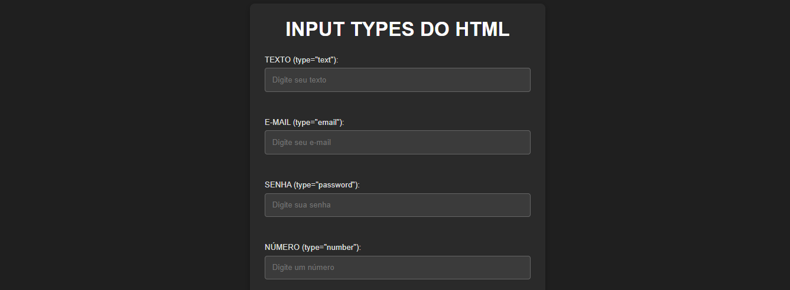
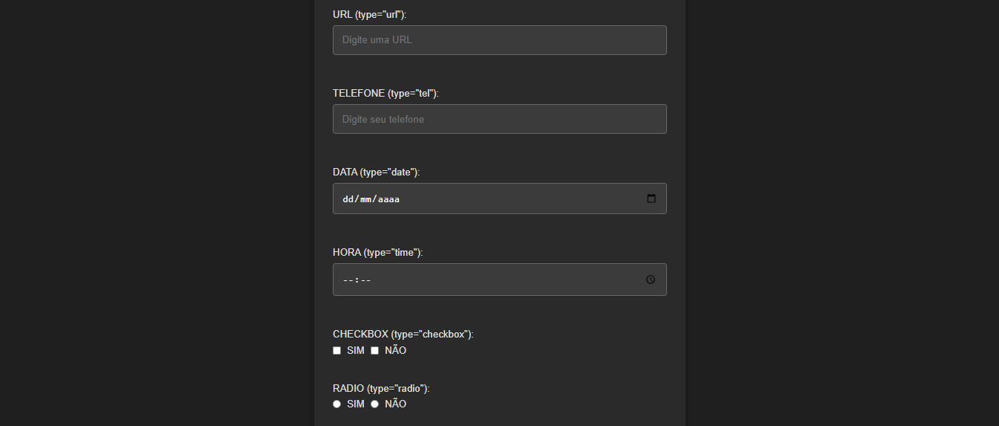
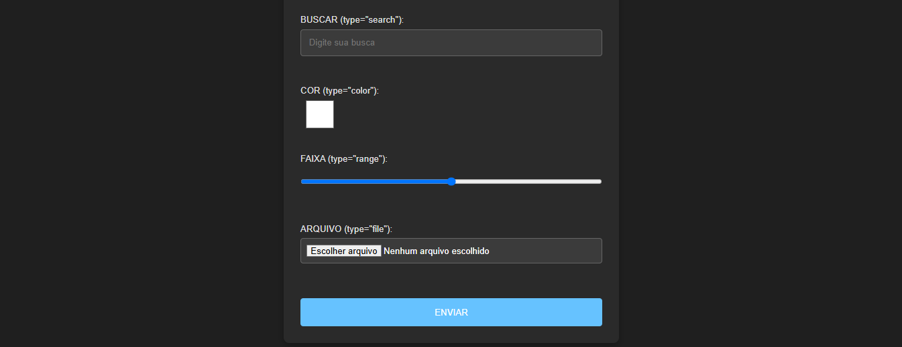

# INPUT TYPES DO HTML
👨‍🏫O PROJETO É UMA DEMONSTRAÇÃO INTERATIVA DE DIVERSOS TIPOS DE INPUTS DE FORMULÁRIO DISPONÍVEIS NO HTML5.

  
  
  

## DESCRIÇÃO:
O projeto é uma demonstração interativa de diversos tipos de inputs de formulário disponíveis no HTML5. Ele tem como objetivo ilustrar o uso dos tipos de campo de entrada (`input`) e fornecer feedback em tempo real para o usuário à medida que ele interage com os campos do formulário. O foco está em validar e fornecer mensagens de erro ou confirmação relacionadas ao valor inserido em cada campo. Além disso, o projeto também apresenta elementos de interface, como seleção de cores, checkboxes, botões de rádio e faixas de seleção.

## RECURSOS:
1. **Estrutura do Formulário**:
   - O formulário contém uma série de campos de entrada (inputs) com diferentes tipos, como:
     - **Texto** (`text`)
     - **E-mail** (`email`)
     - **Senha** (`password`)
     - **Número** (`number`)
     - **URL** (`url`)
     - **Telefone** (`tel`)
     - **Data** (`date`)
     - **Hora** (`time`)
     - **Checkboxes** (`checkbox`)
     - **Radio buttons** (`radio`)
     - **Busca** (`search`)
     - **Cor** (`color`)
     - **Faixa de valores** (`range`)
     - **Arquivo** (`file`)

2. **Interação com os Campos**:
   - O usuário pode preencher os campos de entrada de forma interativa. À medida que o usuário digita, seleciona ou marca opções, o JavaScript monitora e valida o conteúdo de cada campo.
   
3. **Feedback em Tempo Real**:
   - Para cada campo, o projeto exibe uma **mensagem de feedback** logo abaixo do input, informando se o valor inserido está correto ou se há algum erro. A validação é feita em tempo real, conforme o usuário interage com os campos.

4. **Campos Específicos**:
   - **Cor**: Ao selecionar uma cor usando o seletor de cor, o quadrado exibido ao lado do input é atualizado para mostrar a cor selecionada.
   - **Checkboxes**: O feedback mostra quais opções foram marcadas, com uma mensagem indicando as escolhas feitas.
   - **Radio Buttons**: Mostra qual opção foi selecionada.
   - **Faixa de Valores**: A faixa (`range`) exibe o valor atual conforme o usuário ajusta a barra.
   - **Arquivo**: Mostra se o usuário selecionou ou não um arquivo.

5. **Enviando o Formulário**:
   - O formulário tem um botão "ENVIAR", mas neste exemplo, ele não envia dados para um servidor. O propósito é demonstrar a validação e o feedback visual.

## COMO USAR?
1. **Abrir no Navegador**:
   - Abra o arquivo `./CODIGO/index.html` em um navegador para visualizar a interface e testar os campos de entrada.

2. **Interagir com os Campos**:
   - Teste os diferentes tipos de entrada, como texto, e-mail, senha, etc., e veja o feedback em tempo real.

3. **Verificar Feedback**:
   - Cada vez que você digitar ou interagir com os inputs, o projeto validará os dados e mostrará mensagens de erro ou sucesso abaixo de cada campo, indicando o que precisa ser corrigido.

## NÃO SABE?
- Entendemos que para manipular arquivos em `HTML`, `CSS` e outras linguagens relacionadas, é necessário possuir conhecimento nessas áreas. Para auxiliar nesse aprendizado, oferecemos cursos gratuitos disponíveis:
* [CURSO DE HTML E CSS](https://github.com/VILHALVA/CURSO-DE-HTML-E-CSS)
* [CURSO DE JAVASCRIPT](https://github.com/VILHALVA/CURSO-DE-JAVASCRIPT)
* [CONFIRA MAIS CURSOS](https://github.com/VILHALVA?tab=repositories&q=+topic:CURSO)

## CREDITOS:
- [MINICURSO CRIADO PELO VILHALVA](https://github.com/VILHALVA)
- [CLIQUE AQUI PARA ACESSAR AO MINICURSO](./MINICURSO.md)

